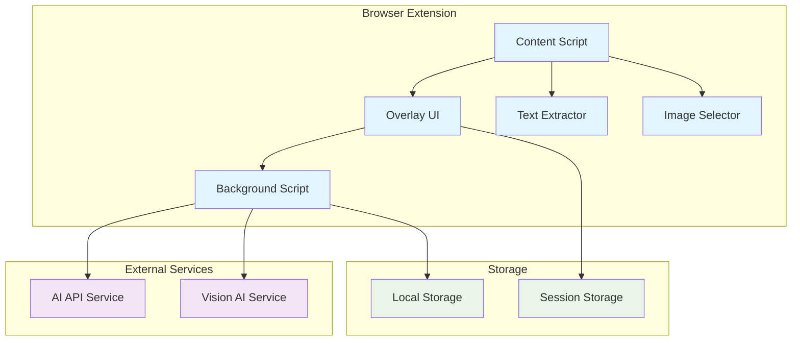

# Design Document: AI Learning Overlay

## Overview

The AI Learning Overlay is a browser extension that provides real-time AI assistance directly over web content. The system uses a content-aware overlay interface that appears when users select text or images, offering contextual explanations, summaries, and interactive exploration without disrupting the learning flow.

### Core Design Principles

1. **Overlay-First Architecture**: The overlay is the primary interface, not a secondary popup or sidebar
2. **Selection-Driven Interaction**: All AI assistance is triggered by user content selection
3. **Minimal Cognitive Load**: Clean sessions for each selection, optional history access
4. **Content-Aware Processing**: Separate pipelines for text extraction vs. visual understanding
5. **Performance-Oriented**: Responsive UI with clear loading states and error handling

### Key Design Decisions

- **Single Overlay Instance**: Only one overlay active at a time to maintain focus and performance
- **Session-Based Context**: Each selection creates a new chat session, preventing context leakage
- **Native Text Extraction**: Use DOM/PDF text layers rather than OCR for reliability and speed
- **Vision-Based Diagram Analysis**: Treat images as visual concepts with conceptual labeling
- **Browser Extension Platform**: Provides universal access across websites and PDF viewers

## Architecture

### High-Level System Architecture



### Component Architecture

The system follows a modular architecture with clear separation of concerns:

1. **Content Layer**: Handles content detection and extraction
2. **UI Layer**: Manages overlay rendering and user interactions
3. **Processing Layer**: Coordinates AI requests and response handling
4. **Storage Layer**: Manages session data and user preferences

## Components and Interfaces

### Content Script (Primary Coordinator)

**Responsibilities:**
- Inject overlay UI into web pages
- Detect and handle text/image selections
- Coordinate between UI components and background services
- Manage overlay lifecycle and positioning

**Key Interfaces:**
```typescript
interface ContentScript {
  initializeOverlay(): void
  handleTextSelection(selection: TextSelection): void
  handleImageSelection(bounds: ImageBounds): void
  positionOverlay(anchor: SelectionAnchor): void
  destroyOverlay(): void
}

interface TextSelection {
  text: string
  range: Range
  boundingRect: DOMRect
  source: 'dom' | 'pdf'
}

interface ImageBounds {
  element: HTMLElement
  coordinates: BoundingBox
  imageData: string
}
```

### Overlay UI Component

**Responsibilities:**
- Render semi-transparent overlay interface
- Handle user interactions (resize, move, dismiss)
- Display AI responses and manage chat interface
- Provide loading states and error handling

**Key Features:**
- Anchored positioning relative to selected content
- Resizable and draggable interface
- Embedded chat component with clean session initialization
- Quick action buttons (Summarize, Explain, Solve)

**Interface:**
```typescript
interface OverlayUI {
  show(anchor: SelectionAnchor, content: SelectionContent): void
  hide(): void
  updatePosition(anchor: SelectionAnchor): void
  displayResponse(response: AIResponse): void
  showLoading(type: 'text' | 'image'): void
  showError(error: ProcessingError): void
}

interface SelectionAnchor {
  boundingRect: DOMRect
  scrollOffset: Point
  element: HTMLElement
}
```

### Text Extractor

**Responsibilities:**
- Extract text from DOM selections
- Handle PDF text layer extraction
- Validate and clean extracted content
- Provide selection context metadata

**Processing Pipeline:**
1. Detect selection type (DOM text vs PDF)
2. Extract raw text using native browser APIs
3. Clean and normalize text content
4. Generate selection metadata (position, source, etc.)

**Interface:**
```typescript
interface TextExtractor {
  extractFromSelection(selection: Selection): TextContent
  extractFromPDF(range: PDFRange): TextContent
  validateContent(content: string): boolean
}

interface TextContent {
  text: string
  source: 'dom' | 'pdf'
  metadata: SelectionMetadata
  boundingRect: DOMRect
}
```

### Image Selector

**Responsibilities:**
- Provide resizable selection box for images
- Capture selected image regions
- Convert images to appropriate format for AI processing
- Handle various image sources (inline, background, SVG)

**Selection Process:**
1. Enter image selection mode
2. Display resizable selection overlay
3. Capture selected region as image data
4. Prepare image for vision AI processing

**Interface:**
```typescript
interface ImageSelector {
  enterSelectionMode(): void
  exitSelectionMode(): void
  captureSelection(bounds: BoundingBox): ImageContent
  handleImageFormats(element: HTMLElement): ImageData
}

interface ImageContent {
  imageData: string
  format: 'png' | 'jpeg' | 'svg'
  dimensions: Dimensions
  boundingBox: BoundingBox
}
```

### Background Script (Service Coordinator)

**Responsibilities:**
- Manage AI API communications
- Handle authentication and rate limiting
- Coordinate between content scripts and external services
- Manage extension-wide state and preferences

**AI Processing Pipeline:**
1. Receive content from content script
2. Determine processing type (text vs image)
3. Format request for appropriate AI service
4. Handle response and error states
5. Return processed response to content script

**Interface:**
```typescript
interface BackgroundScript {
  processTextContent(content: TextContent): Promise<AIResponse>
  processImageContent(content: ImageContent): Promise<VisionResponse>
  manageAPIRateLimit(): void
  handleAuthenticationState(): void
}
```

### AI Service Integration

**Text Processing Service:**
- Handles summarization, explanation, and problem-solving requests
- Maintains conversation context within overlay sessions
- Provides response type indicators (text-derived vs inferred)

**Vision Processing Service:**
- Analyzes diagrams and images using vision-capable AI
- Generates conceptual markers for interactive exploration
- Provides visual understanding with uncertainty indicators

**Interface:**
```typescript
interface AIService {
  summarize(text: string): Promise<SummaryResponse>
  explain(text: string): Promise<ExplanationResponse>
  solve(text: string): Promise<SolutionResponse>
  chat(message: string, context: ChatContext): Promise<ChatResponse>
}

interface VisionService {
  analyzeImage(imageData: string): Promise<ImageAnalysis>
  generateMarkers(analysis: ImageAnalysis): Promise<DiagramMarker[]>
  explainComponent(marker: DiagramMarker): Promise<ComponentExplanation>
}
```

## Data Models

### Core Data Structures

**Selection Context:**
```typescript
interface SelectionContext {
  id: string
  type: 'text' | 'image'
  content: TextContent | ImageContent
  timestamp: Date
  source: ContentSource
}

interface ContentSource {
  url: string
  title: string
  domain: string
  contentType: 'webpage' | 'pdf'
}
```

**Chat Session:**
```typescript
interface ChatSession {
  id: string
  selectionContext: SelectionContext
  messages: ChatMessage[]
  createdAt: Date
  isActive: boolean
}

interface ChatMessage {
  id: string
  type: 'user' | 'assistant'
  content: string
  timestamp: Date
  responseType?: 'text-derived' | 'visual-understanding' | 'inferred'
}
```

**AI Response Models:**
```typescript
interface AIResponse {
  content: string
  type: 'summary' | 'explanation' | 'solution' | 'chat'
  responseSource: 'text-derived' | 'inferred'
  confidence?: number
  processingTime: number
}

interface VisionResponse {
  description: string
  markers: DiagramMarker[]
  concepts: string[]
  responseSource: 'visual-understanding'
  processingTime: number
}

interface DiagramMarker {
  id: string
  position: Point
  label: string
  description: string
  conceptualArea: BoundingBox
}
```

**Learning Hub Models:**
```typescript
interface SavedInteraction {
  id: string
  selectionContext: SelectionContext
  aiResponse: AIResponse | VisionResponse
  chatHistory?: ChatMessage[]
  savedAt: Date
  tags: string[]
}

interface UploadedDocument {
  id: string
  filename: string
  content: string
  uploadedAt: Date
  chatSessions: ChatSession[]
}
```

### Storage Strategy

**Session Storage (Temporary):**
- Active overlay state
- Current chat session
- UI preferences (position, size)

**Local Storage (Persistent):**
- Saved interactions (Learning Hub)
- User preferences
- Authentication tokens
- Extension settings

**Memory Management:**
- Limit chat history to 50 messages per session
- Auto-cleanup inactive sessions after 1 hour
- Compress saved interactions older than 30 days

## Correctness Properties

*A property is a characteristic or behavior that should hold true across all valid executions of a system—essentially, a formal statement about what the system should do. Properties serve as the bridge between human-readable specifications and machine-verifiable correctness guarantees.*

### Property 1: Overlay Positioning Consistency
*For any* content selection and subsequent page changes (scrolling, resizing), the overlay should maintain its relative position to the anchored content and update its position appropriately when the anchor moves.
**Validates: Requirements 1.2, 1.3**

### Property 2: Singleton Overlay Behavior
*For any* sequence of overlay triggers, only one overlay instance should be active at any time, with new triggers replacing the existing overlay.
**Validates: Requirements 1.7, 9.5**

### Property 3: Content-Type Processing Pipeline Selection
*For any* content selection, the system should automatically choose text extraction for text selections and vision-based processing for image selections, never mixing the two approaches.
**Validates: Requirements 2.2, 3.4, 3.5, 5.7**

### Property 4: Selection Detection and Response
*For any* valid text or image selection, the system should detect the selection and trigger the appropriate UI response (quick actions for text, selection box for images).
**Validates: Requirements 2.1, 2.4**

### Property 5: Context Preservation Within Sessions
*For any* overlay session, the original selected content should remain accessible and unchanged throughout all interactions within that session.
**Validates: Requirements 2.5**

### Property 6: Image Format Processing Support
*For any* common image format (PNG, JPEG, SVG), the vision AI should be able to process the content and provide analysis results.
**Validates: Requirements 3.3**

### Property 7: Interactive Diagram Marker Behavior
*For any* processed diagram with markers, clicking on any marker should expand the overlay with detailed explanations specific to that marker's component.
**Validates: Requirements 4.3**

### Property 8: Response Source Transparency
*For any* AI response, the system should clearly indicate whether the response is based on extracted text, visual understanding, or inference beyond the visible content.
**Validates: Requirements 5.2, 5.3**

### Property 9: Session Isolation
*For any* new content selection, the system should create a clean chat session that is isolated from previous interactions and history.
**Validates: Requirements 5.4, 5.6**

### Property 10: Performance Response Times
*For any* overlay trigger under normal conditions, the interface should appear within 500ms, text processing should complete within 5 seconds, and image processing should complete within 10 seconds.
**Validates: Requirements 9.1, 9.2, 9.3**

### Property 11: Non-Blocking Content Extraction
*For any* content extraction operation, the overlay UI should remain responsive and not block user interactions during the extraction process.
**Validates: Requirements 9.6**

### Property 12: Loading State Feedback
*For any* processing operation (text or image), the system should display appropriate loading indicators until the operation completes or fails.
**Validates: Requirements 9.4**

## Error Handling

### Error Categories and Responses

**Content Extraction Errors:**
- Invalid or empty text selections → Display "No valid text selected" message with retry option
- Inaccessible PDF content → Provide fallback message explaining PDF limitations
- Image capture failures → Show "Unable to capture image" with manual retry option

**AI Processing Errors:**
- API rate limiting → Display "Service temporarily unavailable" with retry timer
- Network connectivity issues → Show "Connection error" with retry button
- Invalid or corrupted content → Explain content cannot be processed with alternative suggestions

**UI and Interaction Errors:**
- Overlay positioning failures → Fall back to center-screen positioning
- Resize/move operation conflicts → Reset to default size and position
- Browser compatibility issues → Provide graceful degradation with core functionality

### Error Recovery Strategies

1. **Automatic Retry Logic**: Implement exponential backoff for transient failures
2. **Fallback Modes**: Provide reduced functionality when full features are unavailable
3. **User Communication**: Clear error messages with actionable next steps
4. **State Recovery**: Preserve user context and selections when possible during error recovery

### Error Logging and Monitoring

- Log client-side errors for debugging without exposing user content
- Track error rates and patterns for system improvement
- Provide user feedback mechanism for reporting persistent issues

## Testing Strategy

### Dual Testing Approach

The AI Learning Overlay requires both unit testing and property-based testing for comprehensive coverage:

**Unit Tests** focus on:
- Specific UI interaction examples (overlay trigger, dismiss actions)
- Integration points between content scripts and background services
- Error conditions and edge cases (empty selections, network failures)
- Browser API interactions and compatibility

**Property-Based Tests** focus on:
- Universal properties that hold across all content types and selections
- Comprehensive input coverage through randomization of text and image content
- Performance characteristics across different content sizes and types
- Session isolation and state management across multiple interactions

### Property-Based Testing Configuration

**Testing Framework**: Use fast-check (JavaScript/TypeScript) for property-based testing
**Test Configuration**:
- Minimum 100 iterations per property test
- Each property test references its design document property
- Tag format: **Feature: ai-learning-overlay, Property {number}: {property_text}**

**Example Property Test Structure**:
```typescript
// Feature: ai-learning-overlay, Property 3: Content-Type Processing Pipeline Selection
fc.assert(fc.property(
  fc.oneof(textSelectionArb, imageSelectionArb),
  (selection) => {
    const pipeline = determinePipeline(selection);
    if (selection.type === 'text') {
      expect(pipeline).toBe('text-extraction');
    } else {
      expect(pipeline).toBe('vision-processing');
    }
  }
), { numRuns: 100 });
```

### Unit Testing Focus Areas

**Content Script Testing**:
- Text selection detection across different DOM structures
- Image selection box positioning and resizing
- Overlay lifecycle management (create, position, destroy)

**UI Component Testing**:
- Overlay rendering and positioning
- Chat interface functionality
- Quick action button interactions
- Loading states and error displays

**Background Script Testing**:
- AI API integration and error handling
- Rate limiting and authentication
- Response formatting and validation

**Integration Testing**:
- End-to-end selection-to-response flows
- Cross-browser compatibility
- PDF viewer integration
- Performance under various content types

### Test Data Generation

**Text Content Generators**:
- Academic text samples of varying lengths
- Technical documentation excerpts
- Mathematical expressions and formulas
- Multi-language content for internationalization

**Image Content Generators**:
- Synthetic diagrams with known components
- Charts and graphs with measurable elements
- Screenshots of UI elements
- Scientific diagrams and flowcharts

### Performance Testing

**Metrics to Track**:
- Overlay appearance time (target: <500ms)
- Text processing response time (target: <5s)
- Image processing response time (target: <10s)
- Memory usage during extended sessions
- CPU impact during idle and active states

**Load Testing Scenarios**:
- Rapid successive selections
- Large text selections (>10KB)
- High-resolution image processing
- Extended chat sessions (>50 messages)
- Multiple browser tabs with active overlays